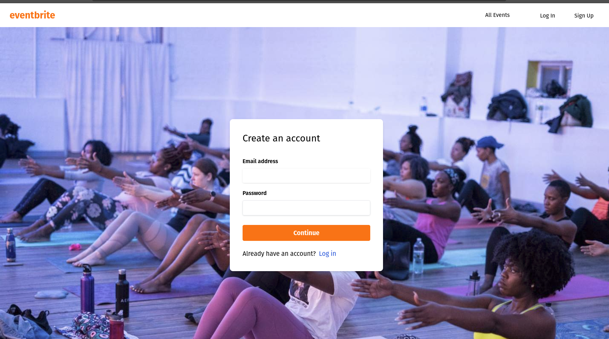
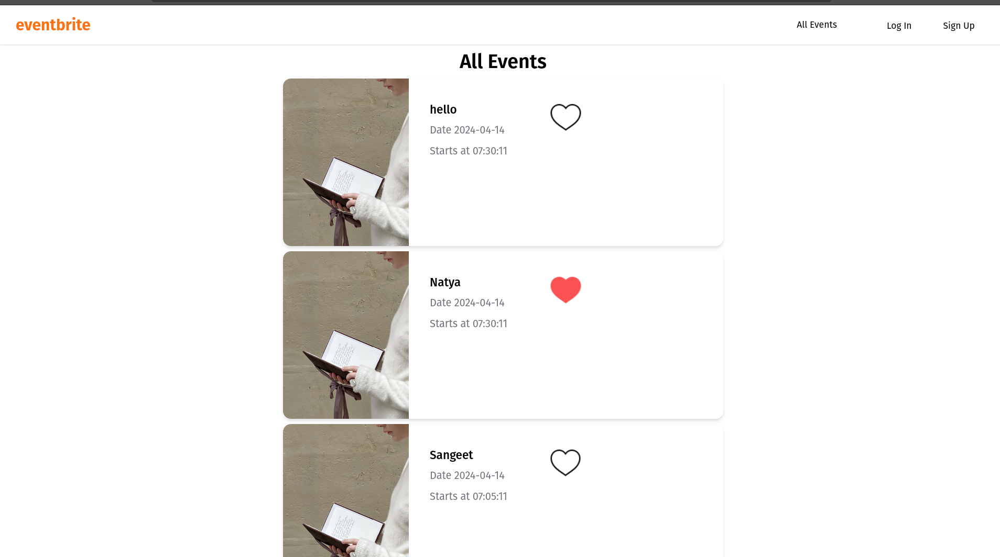

#Event Management Website

## Overview

This website is an event management platform built using ReactJS for the frontend, Django for the backend, and MySQL as the database. It includes user authentication, event creation, event listing, event liking, and user-specific event viewing functionalities.

## Features

- **User Authentication**: Users can create accounts and sign in securely.
- **Event Creation**: Authenticated users can create events and post them on the platform.
- **All Events Listing**: All events posted by authenticated users are listed on the platform.
- **Event Liking**: Users can like other people's events.
- **User-specific Event Viewing**: Users can view their own events in a separate section.
- **Upcoming Functionality**: Currently working on adding functionality to filter and view only upcoming events.

## Technologies Used

- **Frontend**:
  - ReactJS
  - HTML/CSS
- **Backend**:
  - Django
- **Database**:
  - MySQL
  - 
## Future Work

- Implement functionality to filter and view only upcoming events.
- Enhance user interface and user experience.
- Add features such as event comments, event sharing, and user profile customization.

# UI SCREENSHOTS

